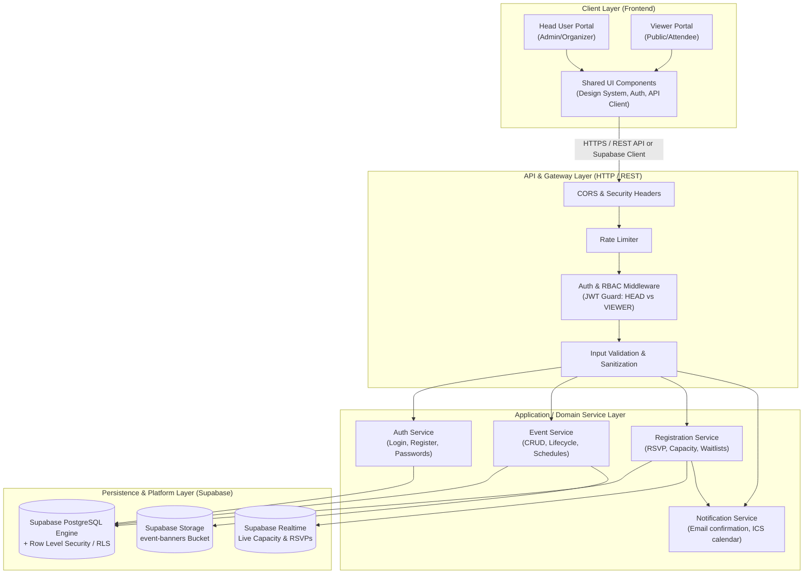
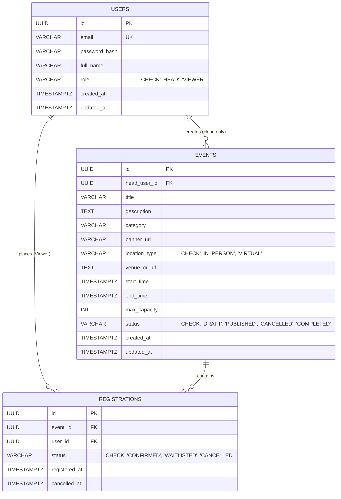
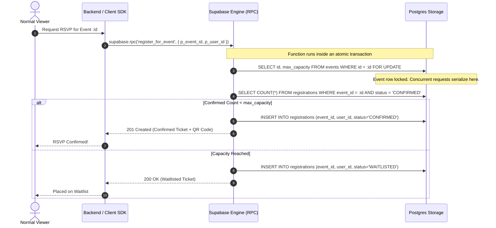
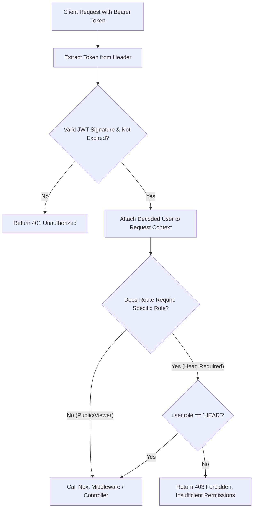

# EventFlow — System Architecture Document

> Technical architecture, system design, data flow, and component specifications for the **EventFlow Event Management System**, derived from [idea.md](file:///c:/Users/lenovo/lfdt/idea.md).

---

## 1. Architectural Overview & Design Principles

EventFlow is architected as a **Layered Modular Architecture** (Client-Server 3-Tier Model). This model ensures clean separation of concerns, high maintainability, and horizontal scalability while keeping deployment lightweight.



### Core Design Principles:
1. **Strict Role Isolation (RBAC):** Head actions (create, edit, delete, export) and Viewer actions (browse, register, cancel RSVP) are enforced at the API route handler and middleware levels.
2. **ACID Transactions for Capacity Safety:** Registrations enforce strict transactional locks to prevent over-subscription and race conditions during high-volume seat reservations.
3. **Stateless API:** The backend is stateless, relying on cryptographic JWTs for session identification, making it horizontally scalable.
4. **Loose Coupling:** Services communicate through clean domain interfaces, enabling individual components to be extracted into microservices if needed.

---

## 2. Layered Component Breakdown

### 2.1 Client Layer (Presentation)
The frontend is split into two primary experiences within a single unified Single Page Application (SPA):

* **Viewer Experience:**
  * **Public Catalog:** Responsive grid of event cards with search, category filtering, and date range pickers.
  * **Event Detail View:** Rich presentation of title, schedule, venue/meeting link, speaker notes, and real-time seat counter.
  * **RSVP & My Bookings:** Modal registration form, ticket confirmation view with QR code, and personal registration manager.
* **Head User Experience:**
  * **Organizer Studio:** Dashboard showing aggregate statistics (Total Events, Active Registrations, Capacity fill rates).
  * **Event Builder:** Multi-step or reactive form for event creation (drafting, editing, publishing, venue setup, capacity limits).
  * **Attendee Management Table:** Searchable table of registered participants with status toggles (Confirmed, Waitlisted, Cancelled) and CSV export.

### 2.2 API & Middleware Layer
All requests pass through a pipeline of defense-in-depth middlewares:


1. **Authentication Guard:** Parses `Authorization: Bearer <token>`, validates signature and expiration, and hydrates `req.user`.
2. **Role Guard (`requireRole('HEAD')`):** Verifies if the authenticated user possesses the appropriate permissions before delegating to the controller.
3. **Schema Validator:** Validates incoming request payloads (using Zod or Joi) to ensure type safety and eliminate malformed data before hitting domain services.

### 2.3 Application & Business Logic Layer
* **`AuthService`:** Manages user registration, password hashing (Argon2 / bcrypt), credential verification, and JWT generation with role claims.
* **`EventService`:** Handles event creation, updates, lifecycle state machine (`DRAFT` &rarr; `PUBLISHED` &rarr; `CANCELLED` &rarr; `COMPLETED`), and visibility queries.
* **`RegistrationService`:** Orchestrates ticket reservation, evaluates maximum capacity, manages waitlisting, handles cancellations, and ensures data consistency.
* **`NotificationService`:** Dispatches confirmation emails and generates downloadable `.ics` calendar invitation payloads.

---

## 3. Database Architecture & Data Modeling

### 3.1 Relational Schema Diagram
The database uses a clean, normalized relational design:



### 3.2 Indexing Strategy for High Query Performance
* `USERS(email)`: Unique index for fast O(1) authentication lookups.
* `EVENTS(status, start_time)`: Composite index for public catalog queries (filtering published, future events).
* `EVENTS(head_user_id)`: Foreign key index for head users managing their own events.
* `REGISTRATIONS(event_id, status)`: Index for real-time capacity and attendee roster queries.
* `REGISTRATIONS(event_id, user_id)`: Unique composite constraint ensuring a user cannot register for the same event multiple times.

---

## 4. Concurrency & Race Condition Strategy

A critical challenge in event management systems is **overselling tickets** when multiple users attempt to register simultaneously for the final remaining seat.

### Concurrency Solution: Atomic Reservation via Supabase Database Function (RPC)

In Supabase, atomic operations are encapsulated inside a PostgreSQL Database Function (`register_for_event`) executed via Remote Procedure Call (`supabase.rpc('register_for_event', ...)`), ensuring sub-millisecond execution and complete isolation.



* **Execution Engine:** Supabase PostgreSQL Function with `SECURITY DEFINER`.
* **Lock Mechanism:** `SELECT ... FOR UPDATE` locks the specific event row during capacity calculation, preventing race conditions and zero overbooking under high concurrency.

---

## 5. API Specification (REST Interface)

All endpoints return uniform JSON envelopes:
```json
{
  "success": true,
  "data": { ... },
  "error": null
}
```

### 5.1 Authentication Endpoints
| Method | Endpoint | Access | Description |
| :--- | :--- | :--- | :--- |
| `POST` | `/api/v1/auth/register` | Public | Register new user (select `role: HEAD \| VIEWER`). |
| `POST` | `/api/v1/auth/login` | Public | Authenticate user and return JWT bearer token. |
| `GET` | `/api/v1/auth/me` | Authenticated | Retrieve authenticated user profile and active role. |

### 5.2 Event Management Endpoints
| Method | Endpoint | Access | Description |
| :--- | :--- | :--- | :--- |
| `GET` | `/api/v1/events` | Public | List published events with query filters (`category`, `date`, `search`). |
| `GET` | `/api/v1/events/:id` | Public | Get full event details, agenda, and remaining capacity. |
| `POST` | `/api/v1/events` | **Head Only** | Create a new event (defaults to `DRAFT` or `PUBLISHED`). |
| `PUT / PATCH`| `/api/v1/events/:id` | **Head Only** | Edit event details, schedule, or capacity. |
| `PATCH` | `/api/v1/events/:id/status`| **Head Only** | Update event status (`PUBLISHED`, `CANCELLED`, `COMPLETED`). |
| `DELETE` | `/api/v1/events/:id` | **Head Only** | Soft-delete an event. |

### 5.3 Registration Endpoints
| Method | Endpoint | Access | Description |
| :--- | :--- | :--- | :--- |
| `POST` | `/api/v1/events/:id/register` | **Viewer Only** | Reserve seat / RSVP for an event. |
| `DELETE`| `/api/v1/events/:id/register` | **Viewer Only** | Cancel personal registration (frees seat). |
| `GET` | `/api/v1/users/me/registrations`| **Viewer Only** | View personal registered events history. |
| `GET` | `/api/v1/events/:id/attendees`| **Head Only** | View roster of all registered attendees for the event. |
| `GET` | `/api/v1/events/:id/export` | **Head Only** | Export attendee list as CSV file. |

---

## 6. Authentication & Authorization Architecture

### 6.1 JWT Payload Structure
```json
{
  "sub": "b2c3d4e5-6789-40ab-cdef-0123456789ab",
  "email": "organizer@example.com",
  "fullName": "Sarah Jenkins",
  "role": "HEAD",
  "iat": 1756890000,
  "exp": 1756976400
}
```

### 6.2 Role Guard Implementation Flow


---

## 7. Recommended Project File Structure

A clean, modular directory structure for implementing this architecture:

```text
lfdt-eventflow/
├── docs/
│   ├── idea.md                 # Product idea & requirements specification
│   └── architecture.md         # System & technical architecture (this document)
├── client/                     # Frontend Application
│   ├── public/                 # Static assets (favicons, stock banners)
│   ├── src/
│   │   ├── api/                # API client Axios/Fetch wrappers
│   │   ├── assets/             # Images and styles
│   │   ├── components/         # Reusable UI widgets
│   │   │   ├── common/         # Buttons, Inputs, Modals, Navbar
│   │   │   ├── events/         # EventCard, EventGrid, EventFilter
│   │   │   └── head/           # AttendeeTable, EventForm, AnalyticsCard
│   │   ├── context/            # AuthContext & State management
│   │   ├── pages/              # Route views
│   │   │   ├── CatalogPage.jsx
│   │   │   ├── EventDetailPage.jsx
│   │   │   ├── HeadDashboard.jsx
│   │   │   ├── CreateEventPage.jsx
│   │   │   └── MyRegistrationsPage.jsx
│   │   ├── App.jsx             # Route definitions & Role guards
│   │   └── main.jsx
├── server/                     # Backend API Application
│   ├── src/
│   │   ├── config/             # DB & Supabase client config (supabase.js)
│   │   ├── controllers/        # Request & response handlers
│   │   │   ├── auth.controller.js
│   │   │   ├── event.controller.js
│   │   │   └── registration.controller.js
│   │   ├── middlewares/        # Security, Auth, & RBAC guards
│   │   ├── services/           # Core business logic & Supabase RPC callers
│   │   ├── scripts/            # Supabase SQL schema & local seeders
│   │   ├── routes/             # Express API routes
│   │   └── app.js              # Server entry point
│   ├── package.json
│   └── README.md
```

---

## 8. Security & Non-Functional Requirements

1. **Password Security:** Salted hashes using **Argon2id** or **bcrypt** with minimum cost factor 12.
2. **CORS & CSRF:** Restrict CORS origins strictly to client application domains.
3. **Data Sanitization:** Defense against SQL injection using parameterized queries / ORM, and XSS prevention by sanitizing user-submitted event descriptions before rendering.
4. **Resilience & Rate Limiting:** Enforce strict rate-limiting on sensitive routes:
   * `/api/v1/auth/login`: 5 attempts per 15 minutes.
   * `/api/v1/events/:id/register`: 10 requests per minute per IP.
5. **Auditing:** Log all Head User administrative actions (event deletion, status modification, attendee cancellation) with timestamp and User ID for accountability.
