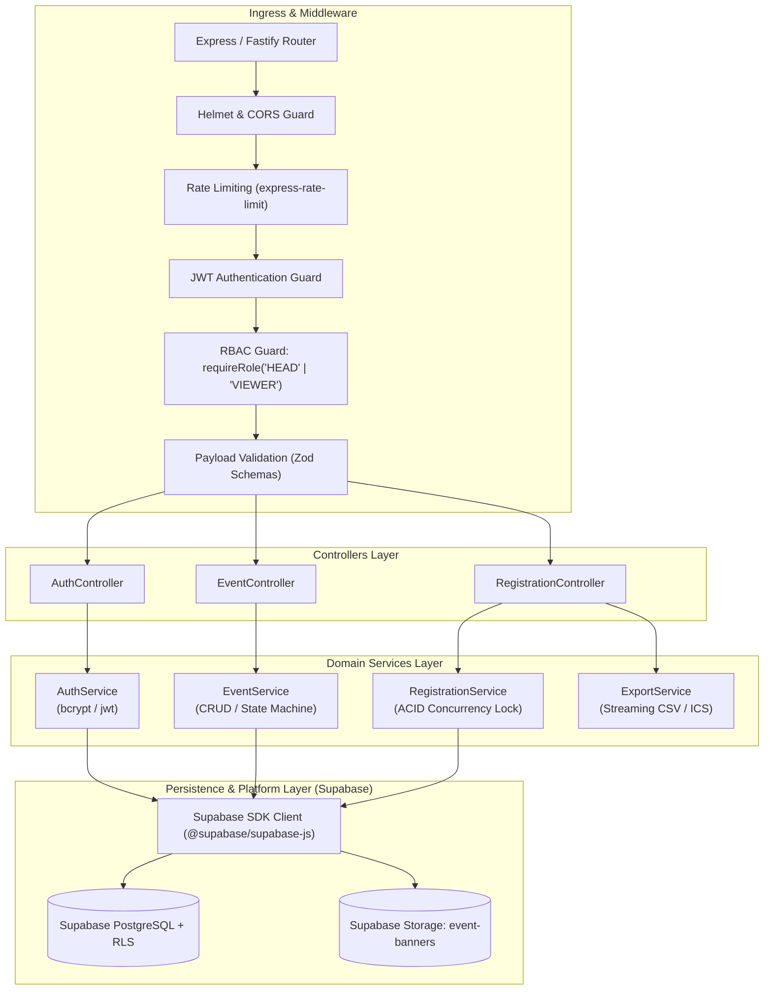

# EventFlow — Backend Specification & Implementation Guide

> Technical implementation details, API controller contracts, database migrations, authentication engine, and concurrency logic for the **EventFlow Backend API**, derived from [idea.md](file:///c:/Users/lenovo/lfdt/idea.md) and [architecture.md](file:///c:/Users/lenovo/lfdt/architecture.md).

---

## 1. Backend Architecture & Runtime Environment

The EventFlow backend is built as a modular RESTful service adhering to the **Controller-Service-Repository (Layered)** design pattern.



---

## 2. Database DDL & Schema Definitions

### 2.1 PostgreSQL DDL Schema
```sql
-- Enable UUID extension
CREATE EXTENSION IF NOT EXISTS "uuid-ossp";

-- 1. Create Enums
CREATE TYPE user_role AS ENUM ('HEAD', 'VIEWER');
CREATE TYPE event_status AS ENUM ('DRAFT', 'PUBLISHED', 'CANCELLED', 'COMPLETED');
CREATE TYPE location_type AS ENUM ('IN_PERSON', 'VIRTUAL');
CREATE TYPE registration_status AS ENUM ('CONFIRMED', 'WAITLISTED', 'CANCELLED');

-- 2. Users Table
CREATE TABLE users (
    id UUID PRIMARY KEY DEFAULT uuid_generate_v4(),
    email VARCHAR(255) UNIQUE NOT NULL,
    password_hash VARCHAR(255) NOT NULL,
    full_name VARCHAR(150) NOT NULL,
    role user_role NOT NULL DEFAULT 'VIEWER',
    created_at TIMESTAMPTZ DEFAULT CURRENT_TIMESTAMP,
    updated_at TIMESTAMPTZ DEFAULT CURRENT_TIMESTAMP
);

-- 3. Events Table
CREATE TABLE events (
    id UUID PRIMARY KEY DEFAULT uuid_generate_v4(),
    head_user_id UUID NOT NULL REFERENCES users(id) ON DELETE CASCADE,
    title VARCHAR(200) NOT NULL,
    description TEXT NOT NULL,
    category VARCHAR(80) NOT NULL,
    banner_url VARCHAR(500),
    location_type location_type NOT NULL DEFAULT 'IN_PERSON',
    venue_or_url TEXT NOT NULL,
    start_time TIMESTAMPTZ NOT NULL,
    end_time TIMESTAMPTZ NOT NULL,
    max_capacity INTEGER NOT NULL CHECK (max_capacity > 0),
    status event_status NOT NULL DEFAULT 'DRAFT',
    created_at TIMESTAMPTZ DEFAULT CURRENT_TIMESTAMP,
    updated_at TIMESTAMPTZ DEFAULT CURRENT_TIMESTAMP
);

-- 4. Registrations Table
CREATE TABLE registrations (
    id UUID PRIMARY KEY DEFAULT uuid_generate_v4(),
    event_id UUID NOT NULL REFERENCES events(id) ON DELETE CASCADE,
    user_id UUID NOT NULL REFERENCES users(id) ON DELETE CASCADE,
    status registration_status NOT NULL DEFAULT 'CONFIRMED',
    registered_at TIMESTAMPTZ DEFAULT CURRENT_TIMESTAMP,
    cancelled_at TIMESTAMPTZ,
    CONSTRAINT unique_event_user UNIQUE (event_id, user_id)
);

-- 5. Performance Indexes
CREATE INDEX idx_events_status_start ON events(status, start_time);
CREATE INDEX idx_events_head_user ON events(head_user_id);
CREATE INDEX idx_registrations_event_status ON registrations(event_id, status);
CREATE INDEX idx_registrations_user ON registrations(user_id);
```

---

## 3. Authentication & RBAC Engine

### 3.1 Token Verification & Role Guard Middleware
```javascript
// src/middlewares/auth.middleware.js
const jwt = require('jsonwebtoken');

const authenticateToken = (req, res, next) => {
  const authHeader = req.headers['authorization'];
  const token = authHeader && authHeader.split(' ')[1]; // Format: Bearer <token>

  if (!token) {
    return res.status(401).json({ success: false, error: 'Access token required.' });
  }

  jwt.verify(token, process.env.JWT_SECRET, (err, decodedUser) => {
    if (err) {
      return res.status(403).json({ success: false, error: 'Token is invalid or expired.' });
    }
    req.user = decodedUser; // { id, email, role, fullName }
    next();
  });
};

const requireRole = (...allowedRoles) => {
  return (req, res, next) => {
    if (!req.user || !allowedRoles.includes(req.user.role)) {
      return res.status(403).json({
        success: false,
        error: `Forbidden: Requires one of the following roles: [${allowedRoles.join(', ')}]`
      });
    }
    next();
  };
};

module.exports = { authenticateToken, requireRole };
```

---

## 4. Concurrency & Race-Condition Safe Registration Engine

When seats are limited (e.g., last 1 seat remaining) and hundreds of users RSVP simultaneously, standard `SELECT` followed by `INSERT` causes **overselling (race condition)**.

### Supabase Solution: Calling the Atomic RPC Function (`register_for_event`)

Using `@supabase/supabase-js`, the backend or frontend client calls the database stored procedure directly. This executes inside a PostgreSQL transaction with `SELECT ... FOR UPDATE` row locks, ensuring zero overselling:

```javascript
// src/services/registration.service.js
const { supabase } = require('../config/supabase');

async function registerForEvent(eventId, userId) {
  // Call the Supabase PostgreSQL stored procedure
  const { data, error } = await supabase.rpc('register_for_event', {
    p_event_id: eventId,
    p_user_id: userId
  });

  if (error) {
    const err = new Error(error.message);
    err.status = error.message.includes('not found') ? 404 : 400;
    throw err;
  }

  return {
    registrationId: data.registration_id,
    eventId: data.event_id,
    status: data.status,
    ticketCode: data.ticket_code,
    message: data.message
  };
}
```


---

## 5. API Endpoints & Request/Response Contracts

### 5.1 Auth Controller

#### 1. Register User
* **Method & Route:** `POST /api/v1/auth/register`
* **Access:** Public
* **Request Body:**
```json
{
  "email": "sarah.head@example.com",
  "password": "SecurePassword123!",
  "fullName": "Sarah Jenkins",
  "role": "HEAD" 
}
```
* **Success Response (201 Created):**
```json
{
  "success": true,
  "data": {
    "user": {
      "id": "c7a89e1b-3f2d-41a4-9b16-56ef789012cd",
      "email": "sarah.head@example.com",
      "fullName": "Sarah Jenkins",
      "role": "HEAD"
    },
    "token": "eyJhbGciOiJIUzI1NiIsInR5cCI6IkpXVCJ9..."
  }
}
```

#### 2. User Login
* **Method & Route:** `POST /api/v1/auth/login`
* **Access:** Public
* **Request Body:**
```json
{
  "email": "sarah.head@example.com",
  "password": "SecurePassword123!"
}
```
* **Success Response (200 OK):**
```json
{
  "success": true,
  "data": {
    "token": "eyJhbGciOiJIUzI1NiIsInR5cCI6IkpXVCJ9...",
    "user": {
      "id": "c7a89e1b-3f2d-41a4-9b16-56ef789012cd",
      "email": "sarah.head@example.com",
      "fullName": "Sarah Jenkins",
      "role": "HEAD"
    }
  }
}
```

---

### 5.2 Event Controller

#### 3. List Events (Catalog)
* **Method & Route:** `GET /api/v1/events?category=Tech&search=AI&page=1&limit=10`
* **Access:** Public
* **Success Response (200 OK):**
```json
{
  "success": true,
  "data": {
    "events": [
      {
        "id": "e9b4d1c2-5502-4217-bfd2-08a6b189a0b1",
        "title": "Full-Stack AI Summit 2026",
        "category": "Tech",
        "bannerUrl": "https://images.unsplash.com/photo-1540575467063-178a50c2df87",
        "locationType": "IN_PERSON",
        "venueOrUrl": "Auditorium Hall B, Tech Park",
        "startTime": "2026-10-14T09:00:00Z",
        "endTime": "2026-10-14T17:00:00Z",
        "maxCapacity": 100,
        "confirmedAttendees": 68,
        "remainingSeats": 32,
        "status": "PUBLISHED"
      }
    ],
    "pagination": { "total": 1, "page": 1, "totalPages": 1 }
  }
}
```

#### 4. Create Event
* **Method & Route:** `POST /api/v1/events`
* **Access:** **Head Only** (`requireRole('HEAD')`)
* **Request Body:**
```json
{
  "title": "Advanced Node.js Architecture",
  "description": "Deep-dive workshop into building scalable microservices.",
  "category": "Workshops",
  "bannerUrl": "https://example.com/banner.jpg",
  "locationType": "VIRTUAL",
  "venueOrUrl": "https://meet.google.com/abc-defg-hij",
  "startTime": "2026-11-05T14:00:00Z",
  "endTime": "2026-11-05T18:00:00Z",
  "maxCapacity": 75,
  "status": "PUBLISHED"
}
```
* **Success Response (201 Created):** Returns the complete event object.

---

### 5.3 Registration & Roster Controller

#### 5. Register for Event (Viewer)
* **Method & Route:** `POST /api/v1/events/:id/register`
* **Access:** **Viewer / Authenticated**
* **Success Response (201 Created):**
```json
{
  "success": true,
  "data": {
    "registrationId": "f1a2b3c4-d5e6-7890-a1b2-c3d4e5f67890",
    "status": "CONFIRMED",
    "registeredAt": "2026-09-03T12:15:00Z",
    "eventTitle": "Full-Stack AI Summit 2026",
    "ticketCode": "EF-789012"
  }
}
```

#### 6. Export Attendee Roster (CSV)
* **Method & Route:** `GET /api/v1/events/:id/export`
* **Access:** **Head Only** (`requireRole('HEAD')`)
* **Response Headers:**
  * `Content-Type: text/csv`
  * `Content-Disposition: attachment; filename="attendees_event_123.csv"`
* **Output Stream:**
```csv
Registration ID,Full Name,Email,Status,Registered At
f1a2b3c4...,John Doe,john@example.com,CONFIRMED,2026-09-03 12:15:00
a9b8c7d6...,Jane Smith,jane@tech.io,WAITLISTED,2026-09-03 12:45:10
```

---

## 6. Input Validation Schemas (Zod)

```javascript
// src/validations/event.validation.js
const { z } = require('zod');

const createEventSchema = z.object({
  title: z.string().min(5).max(200),
  description: z.string().min(20),
  category: z.string().min(2).max(80),
  bannerUrl: z.string().url().optional(),
  locationType: z.enum(['IN_PERSON', 'VIRTUAL']),
  venueOrUrl: z.string().min(3),
  startTime: z.string().datetime(),
  endTime: z.string().datetime(),
  maxCapacity: z.number().int().positive(),
  status: z.enum(['DRAFT', 'PUBLISHED']).default('DRAFT')
}).refine(data => new Date(data.endTime) > new Date(data.startTime), {
  message: "End time must be after start time",
  path: ["endTime"]
});

module.exports = { createEventSchema };
```

---

## 7. Environment Variables Configuration (`.env.example`)

```env
# Server
PORT=5000
NODE_ENV=development

# Supabase Configuration
SUPABASE_URL=https://your-project-id.supabase.co
SUPABASE_ANON_KEY=eyJhbGciOiJIUzI1NiIsInR5cCI6IkpXVCJ9...
SUPABASE_SERVICE_ROLE_KEY=eyJhbGciOiJIUzI1NiIsInR5cCI6IkpXVCJ9...

# Security & Tokens
JWT_SECRET=super_secret_cryptographic_key_min_32_chars
JWT_EXPIRES_IN=7d

# CORS
CORS_ORIGIN=http://localhost:3000
```

---

## 8. Summary of Completed Project Documentation

With Supabase integrated, the documentation suite for the Event Management System is complete and consistent:
* [idea.md](file:///c:/Users/lenovo/lfdt/code%20and%20files/idea.md) — Product vision, roles, problem/solution, and user journeys.
* [architecture.md](file:///c:/Users/lenovo/lfdt/code%20and%20files/architecture.md) — System design, high-level diagrams, and Supabase BaaS layered separation.
* [frontend.md](file:///c:/Users/lenovo/lfdt/code%20and%20files/frontend.md) — UI/UX wireframes, component hierarchy, and Supabase Auth/Realtime/Storage integration.
* [backend.md](file:///c:/Users/lenovo/lfdt/code%20and%20files/backend.md) — REST contracts, RBAC middleware, and Supabase RPC concurrency logic.
* [database.md](file:///c:/Users/lenovo/lfdt/code%20and%20files/database.md) — Supabase PostgreSQL schema, Row Level Security (RLS) policies, RPC functions, and migrations.
