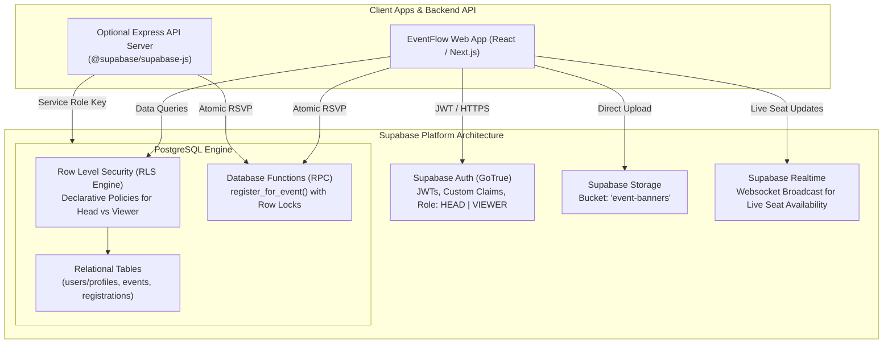
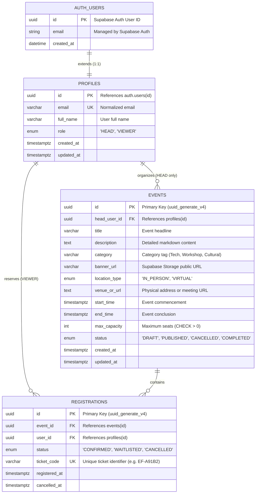
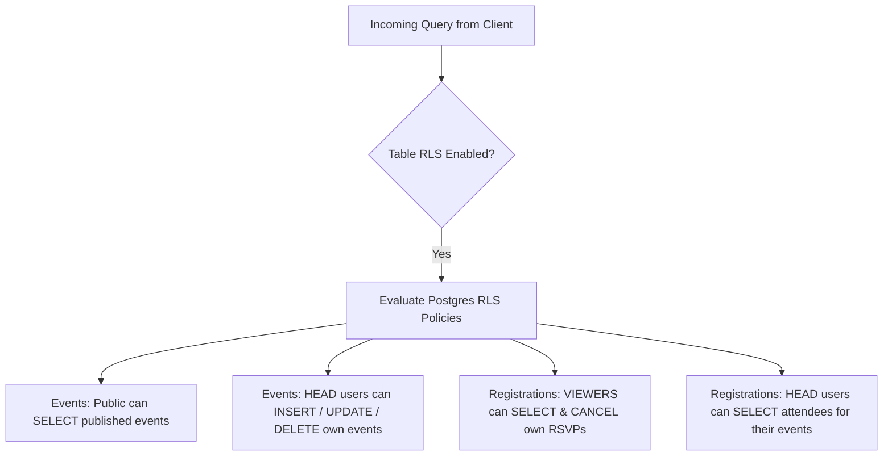

# EventFlow — Supabase Database Design & Architecture

> Complete Supabase architecture, Entity-Relationship Models (ERD), Data Dictionary, Row Level Security (RLS) policies, Database Functions (RPC), Storage configuration, and SQL migration scripts for the **EventFlow Event Management System**, aligned with [idea.md](file:///c:/Users/lenovo/lfdt/code%20and%20files/idea.md) and [architecture.md](file:///c:/Users/lenovo/lfdt/code%20and%20files/architecture.md).

---

## 1. Supabase Architecture & Platform Overview

EventFlow leverages **Supabase** as its unified Backend-as-a-Service (BaaS) and persistence engine. Supabase provides an enterprise-grade hosted PostgreSQL database enriched with native identity management, granular row-level security, media storage, and real-time websockets.



### Why Supabase for EventFlow?
1. **Row Level Security (RLS):** Security is declared in PostgreSQL. Even if frontend clients query Supabase directly, a Viewer cannot modify an event or read other attendees' private details.
2. **ACID Concurrency via RPC:** Supabase Database Functions execute inside PostgreSQL transactions with `SELECT ... FOR UPDATE`, guaranteeing that tickets never oversell under heavy concurrent load.
3. **Built-in Media Storage:** Dedicated CDN-backed storage bucket for event banners (`event-banners`).
4. **Instant Realtime Subscriptions:** Frontend components can subscribe to seat changes (`supabase.channel('public:registrations')`), updating the remaining seat counter live as attendees register.

---

## 2. Entity-Relationship Diagram (ERD)



---

## 3. Detailed Data Dictionary

### 3.1 Table: `public.profiles` (Users)
Extends Supabase `auth.users` with application metadata, display name, and system role.

| Column | Type | Nullable | Default | Constraints & Description |
| :--- | :--- | :---: | :--- | :--- |
| `id` | `UUID` | No | `auth.uid()` | Primary key. Foreign key &rarr; `auth.users(id)` ON DELETE CASCADE. |
| `email` | `VARCHAR(255)` | No | — | Unique, lowercase email address. |
| `full_name` | `VARCHAR(150)` | No | — | User's displayed name. |
| `role` | `user_role` | No | `'VIEWER'` | Custom ENUM: `'HEAD'` (Organizer/Admin) or `'VIEWER'` (Attendee). |
| `created_at` | `TIMESTAMPTZ` | No | `NOW()` | Profile creation timestamp. |
| `updated_at` | `TIMESTAMPTZ` | No | `NOW()` | Automatically updated on profile modification. |

---

### 3.2 Table: `public.events`
Stores event listings, locations, scheduling, capacity caps, and lifecycle states curated by Head users.

| Column | Type | Nullable | Default | Constraints & Description |
| :--- | :--- | :---: | :--- | :--- |
| `id` | `UUID` | No | `gen_random_uuid()` | Primary key. |
| `head_user_id` | `UUID` | No | — | Foreign key &rarr; `profiles(id)` ON DELETE CASCADE. |
| `title` | `VARCHAR(200)` | No | — | Event headline (5 to 200 characters). |
| `description` | `TEXT` | No | — | Detailed rich description and agenda. |
| `category` | `VARCHAR(80)` | No | — | Category tag (e.g., Technology, Workshops, Cultural). |
| `banner_url` | `VARCHAR(500)` | Yes | `NULL` | Public Supabase Storage URL for the event poster. |
| `location_type`| `location_type`| No | `'IN_PERSON'` | ENUM: `'IN_PERSON'` or `'VIRTUAL'`. |
| `venue_or_url` | `TEXT` | No | — | Physical venue room/hall or virtual meeting link. |
| `start_time` | `TIMESTAMPTZ` | No | — | Event commencement date and time. |
| `end_time` | `TIMESTAMPTZ` | No | — | Event conclusion (`CHECK: end_time > start_time`). |
| `max_capacity` | `INTEGER` | No | — | Max allowable attendees (`CHECK: max_capacity > 0`). |
| `status` | `event_status` | No | `'DRAFT'` | ENUM: `'DRAFT'`, `'PUBLISHED'`, `'CANCELLED'`, `'COMPLETED'`. |
| `created_at` | `TIMESTAMPTZ` | No | `NOW()` | Event creation timestamp. |
| `updated_at` | `TIMESTAMPTZ` | No | `NOW()` | Last modified timestamp. |

---

### 3.3 Table: `public.registrations`
Tracks user RSVP reservations, ticket statuses, and capacity allocations.

| Column | Type | Nullable | Default | Constraints & Description |
| :--- | :--- | :---: | :--- | :--- |
| `id` | `UUID` | No | `gen_random_uuid()` | Primary key. |
| `event_id` | `UUID` | No | — | Foreign key &rarr; `events(id)` ON DELETE CASCADE. |
| `user_id` | `UUID` | No | — | Foreign key &rarr; `profiles(id)` ON DELETE CASCADE. |
| `status` | `registration_status` | No | `'CONFIRMED'` | ENUM: `'CONFIRMED'`, `'WAITLISTED'`, `'CANCELLED'`. |
| `ticket_code` | `VARCHAR(32)` | No | — | Unique alphanumeric ticket reference (`UNIQUE`). |
| `registered_at`| `TIMESTAMPTZ` | No | `NOW()` | Timestamp when registration occurred. |
| `cancelled_at` | `TIMESTAMPTZ` | Yes | `NULL` | Timestamp if cancelled. |

* **Unique Constraint:** `CONSTRAINT uq_event_user_reg UNIQUE (event_id, user_id)` guarantees one active registration entry per user per event.

---

## 4. Row Level Security (RLS) Policies

Supabase enforces security rules directly inside the PostgreSQL layer using **Row Level Security (RLS)**:



### 4.1 `events` RLS Policies
```sql
ALTER TABLE events ENABLE ROW LEVEL SECURITY;

-- 1. Public can read all published events
CREATE POLICY "Public can view published events"
ON events FOR SELECT
USING (status = 'PUBLISHED' OR head_user_id = auth.uid());

-- 2. Only Head Users can create events
CREATE POLICY "Head users can create events"
ON events FOR INSERT
WITH CHECK (
  auth.uid() = head_user_id AND
  EXISTS (SELECT 1 FROM profiles WHERE id = auth.uid() AND role = 'HEAD')
);

-- 3. Head Users can update their own events
CREATE POLICY "Head users can update own events"
ON events FOR UPDATE
USING (auth.uid() = head_user_id)
WITH CHECK (auth.uid() = head_user_id);

-- 4. Head Users can delete their own events
CREATE POLICY "Head users can delete own events"
ON events FOR DELETE
USING (auth.uid() = head_user_id);
```

### 4.2 `registrations` RLS Policies
```sql
ALTER TABLE registrations ENABLE ROW LEVEL SECURITY;

-- 1. Users can view their own registrations
CREATE POLICY "Users can view own registrations"
ON registrations FOR SELECT
USING (auth.uid() = user_id);

-- 2. Head Users can view registrations for events they organize
CREATE POLICY "Organizers can view attendees for their events"
ON registrations FOR SELECT
USING (
  EXISTS (
    SELECT 1 FROM events 
    WHERE events.id = registrations.event_id 
      AND events.head_user_id = auth.uid()
  )
);

-- 3. Users can cancel their own registrations
CREATE POLICY "Users can cancel own registrations"
ON registrations FOR UPDATE
USING (auth.uid() = user_id)
WITH CHECK (auth.uid() = user_id);
```

---

## 5. Supabase Concurrency & Atomic RSVP Function (RPC)

To prevent overselling tickets during registration spikes, RSVP operations run through a Supabase **Database Function (RPC)** using pessimistic row-level locking (`SELECT ... FOR UPDATE`):

```sql
CREATE OR REPLACE FUNCTION register_for_event(
  p_event_id UUID,
  p_user_id UUID
)
RETURNS JSONB
LANGUAGE plpgsql
SECURITY DEFINER
AS $$
DECLARE
  v_event RECORD;
  v_confirmed_count INT;
  v_target_status registration_status;
  v_ticket_code VARCHAR(32);
  v_registration_id UUID;
  v_existing RECORD;
BEGIN
  -- 1. Lock the target event row exclusively
  SELECT id, title, max_capacity, status 
  INTO v_event 
  FROM events 
  WHERE id = p_event_id 
  FOR UPDATE;

  IF NOT FOUND THEN
    RAISE EXCEPTION 'Event not found';
  END IF;

  IF v_event.status <> 'PUBLISHED' THEN
    RAISE EXCEPTION 'Event is not open for registration';
  END IF;

  -- 2. Check existing registration
  SELECT id, status INTO v_existing 
  FROM registrations 
  WHERE event_id = p_event_id AND user_id = p_user_id;

  IF FOUND AND v_existing.status = 'CONFIRMED' THEN
    RAISE EXCEPTION 'User is already registered for this event';
  END IF;

  -- 3. Count confirmed attendees
  SELECT COUNT(*)::int INTO v_confirmed_count
  FROM registrations
  WHERE event_id = p_event_id AND status = 'CONFIRMED';

  -- 4. Determine status: CONFIRMED or WAITLISTED
  IF v_confirmed_count < v_event.max_capacity THEN
    v_target_status := 'CONFIRMED';
  ELSE
    v_target_status := 'WAITLISTED';
  END IF;

  -- 5. Generate ticket code
  v_ticket_code := 'EF-' || UPPER(SUBSTRING(MD5(RANDOM()::text) FROM 1 FOR 6));

  -- 6. Insert or Reactivate Registration
  IF FOUND THEN
    UPDATE registrations 
    SET status = v_target_status, 
        registered_at = NOW(), 
        cancelled_at = NULL, 
        ticket_code = v_ticket_code
    WHERE id = v_existing.id
    RETURNING id INTO v_registration_id;
  ELSE
    INSERT INTO registrations (event_id, user_id, status, ticket_code)
    VALUES (p_event_id, p_user_id, v_target_status, v_ticket_code)
    RETURNING id INTO v_registration_id;
  END IF;

  RETURN jsonb_build_object(
    'registration_id', v_registration_id,
    'event_id', p_event_id,
    'status', v_target_status,
    'ticket_code', v_ticket_code,
    'message', CASE WHEN v_target_status = 'CONFIRMED' THEN 'Seat confirmed!' ELSE 'Placed on waitlist.' END
  );
END;
$$;
```

---

## 6. Supabase Storage Bucket Setup (`event-banners`)

Event posters are stored in Supabase Storage:
```sql
-- 1. Create Storage Bucket
INSERT INTO storage.buckets (id, name, public) 
VALUES ('event-banners', 'event-banners', true)
ON CONFLICT (id) DO NOTHING;

-- 2. Allow public read access to event posters
CREATE POLICY "Public can view event banners"
ON storage.objects FOR SELECT
USING (bucket_id = 'event-banners');

-- 3. Allow authenticated Head users to upload banners
CREATE POLICY "Head users can upload event banners"
ON storage.objects FOR INSERT
TO authenticated
WITH CHECK (
  bucket_id = 'event-banners' AND
  EXISTS (SELECT 1 FROM public.profiles WHERE id = auth.uid() AND role = 'HEAD')
);
```

---

## 7. Complete Executable Supabase SQL Migration Script

> **How to run:** Open your **Supabase Dashboard** &rarr; **SQL Editor** &rarr; Paste this script &rarr; Click **Run**.

```sql
-- ====================================================================
-- EventFlow: Complete Supabase Database Setup & Migration Script
-- ====================================================================

-- 1. Create Enums
DO $$ BEGIN
    CREATE TYPE user_role AS ENUM ('HEAD', 'VIEWER');
EXCEPTION WHEN duplicate_object THEN NULL; END $$;

DO $$ BEGIN
    CREATE TYPE event_status AS ENUM ('DRAFT', 'PUBLISHED', 'CANCELLED', 'COMPLETED');
EXCEPTION WHEN duplicate_object THEN NULL; END $$;

DO $$ BEGIN
    CREATE TYPE location_type AS ENUM ('IN_PERSON', 'VIRTUAL');
EXCEPTION WHEN duplicate_object THEN NULL; END $$;

DO $$ BEGIN
    CREATE TYPE registration_status AS ENUM ('CONFIRMED', 'WAITLISTED', 'CANCELLED');
EXCEPTION WHEN duplicate_object THEN NULL; END $$;

-- 2. Profiles Table (extends auth.users)
CREATE TABLE IF NOT EXISTS public.profiles (
    id UUID PRIMARY KEY REFERENCES auth.users(id) ON DELETE CASCADE,
    email VARCHAR(255) NOT NULL UNIQUE,
    full_name VARCHAR(150) NOT NULL,
    role user_role NOT NULL DEFAULT 'VIEWER',
    created_at TIMESTAMPTZ NOT NULL DEFAULT NOW(),
    updated_at TIMESTAMPTZ NOT NULL DEFAULT NOW()
);

-- 3. Events Table
CREATE TABLE IF NOT EXISTS public.events (
    id UUID PRIMARY KEY DEFAULT gen_random_uuid(),
    head_user_id UUID NOT NULL REFERENCES public.profiles(id) ON DELETE CASCADE,
    title VARCHAR(200) NOT NULL,
    description TEXT NOT NULL,
    category VARCHAR(80) NOT NULL,
    banner_url VARCHAR(500),
    location_type location_type NOT NULL DEFAULT 'IN_PERSON',
    venue_or_url TEXT NOT NULL,
    start_time TIMESTAMPTZ NOT NULL,
    end_time TIMESTAMPTZ NOT NULL,
    max_capacity INTEGER NOT NULL CHECK (max_capacity > 0),
    status event_status NOT NULL DEFAULT 'DRAFT',
    created_at TIMESTAMPTZ NOT NULL DEFAULT NOW(),
    updated_at TIMESTAMPTZ NOT NULL DEFAULT NOW(),
    CONSTRAINT chk_events_times CHECK (end_time > start_time)
);

-- 4. Registrations Table
CREATE TABLE IF NOT EXISTS public.registrations (
    id UUID PRIMARY KEY DEFAULT gen_random_uuid(),
    event_id UUID NOT NULL REFERENCES public.events(id) ON DELETE CASCADE,
    user_id UUID NOT NULL REFERENCES public.profiles(id) ON DELETE CASCADE,
    status registration_status NOT NULL DEFAULT 'CONFIRMED',
    ticket_code VARCHAR(32) NOT NULL UNIQUE,
    registered_at TIMESTAMPTZ NOT NULL DEFAULT NOW(),
    cancelled_at TIMESTAMPTZ,
    CONSTRAINT uq_event_user_reg UNIQUE (event_id, user_id)
);

-- 5. Performance Indexes
CREATE INDEX IF NOT EXISTS idx_events_catalog ON public.events(status, start_time ASC) WHERE status = 'PUBLISHED';
CREATE INDEX IF NOT EXISTS idx_events_head ON public.events(head_user_id);
CREATE INDEX IF NOT EXISTS idx_registrations_capacity ON public.registrations(event_id, status);
CREATE INDEX IF NOT EXISTS idx_registrations_user ON public.registrations(user_id, registered_at DESC);

-- 6. Trigger to automatically create profile when user signs up via Supabase Auth
CREATE OR REPLACE FUNCTION public.handle_new_user()
RETURNS TRIGGER AS $$
BEGIN
  INSERT INTO public.profiles (id, email, full_name, role)
  VALUES (
    NEW.id,
    NEW.email,
    COALESCE(NEW.raw_user_meta_data->>'full_name', 'Attendee'),
    COALESCE((NEW.raw_user_meta_data->>'role')::user_role, 'VIEWER')
  );
  RETURN NEW;
END;
$$ LANGUAGE plpgsql SECURITY DEFINER;

DROP TRIGGER IF EXISTS on_auth_user_created ON auth.users;
CREATE TRIGGER on_auth_user_created
  AFTER INSERT ON auth.users
  FOR EACH ROW EXECUTE FUNCTION public.handle_new_user();

-- 7. Row Level Security Policies
ALTER TABLE public.profiles ENABLE ROW LEVEL SECURITY;
ALTER TABLE public.events ENABLE ROW LEVEL SECURITY;
ALTER TABLE public.registrations ENABLE ROW LEVEL SECURITY;

-- Profiles Policies
CREATE POLICY "Public can view profiles" ON public.profiles FOR SELECT USING (true);
CREATE POLICY "Users can update own profile" ON public.profiles FOR UPDATE USING (auth.uid() = id);

-- Events Policies
CREATE POLICY "Public can view published events" ON public.events FOR SELECT USING (status = 'PUBLISHED' OR head_user_id = auth.uid());
CREATE POLICY "Head users can create events" ON public.events FOR INSERT WITH CHECK (
  auth.uid() = head_user_id AND EXISTS (SELECT 1 FROM public.profiles WHERE id = auth.uid() AND role = 'HEAD')
);
CREATE POLICY "Head users can update own events" ON public.events FOR UPDATE USING (auth.uid() = head_user_id);
CREATE POLICY "Head users can delete own events" ON public.events FOR DELETE USING (auth.uid() = head_user_id);

-- Registrations Policies
CREATE POLICY "Users can view own registrations" ON public.registrations FOR SELECT USING (auth.uid() = user_id);
CREATE POLICY "Organizers can view attendees" ON public.registrations FOR SELECT USING (
  EXISTS (SELECT 1 FROM public.events WHERE events.id = registrations.event_id AND events.head_user_id = auth.uid())
);
CREATE POLICY "Users can cancel own registrations" ON public.registrations FOR UPDATE USING (auth.uid() = user_id);

-- 8. Atomic RSVP RPC Stored Procedure
CREATE OR REPLACE FUNCTION public.register_for_event(p_event_id UUID, p_user_id UUID)
RETURNS JSONB
LANGUAGE plpgsql
SECURITY DEFINER
AS $$
DECLARE
  v_event RECORD;
  v_confirmed_count INT;
  v_target_status registration_status;
  v_ticket_code VARCHAR(32);
  v_registration_id UUID;
  v_existing RECORD;
BEGIN
  SELECT id, max_capacity, status INTO v_event FROM public.events WHERE id = p_event_id FOR UPDATE;
  IF NOT FOUND THEN RAISE EXCEPTION 'Event not found'; END IF;
  IF v_event.status <> 'PUBLISHED' THEN RAISE EXCEPTION 'Event not published'; END IF;

  SELECT id, status INTO v_existing FROM public.registrations WHERE event_id = p_event_id AND user_id = p_user_id;
  IF FOUND AND v_existing.status = 'CONFIRMED' THEN RAISE EXCEPTION 'Already registered'; END IF;

  SELECT COUNT(*)::int INTO v_confirmed_count FROM public.registrations WHERE event_id = p_event_id AND status = 'CONFIRMED';
  IF v_confirmed_count < v_event.max_capacity THEN v_target_status := 'CONFIRMED'; ELSE v_target_status := 'WAITLISTED'; END IF;

  v_ticket_code := 'EF-' || UPPER(SUBSTRING(MD5(RANDOM()::text) FROM 1 FOR 6));

  IF FOUND THEN
    UPDATE public.registrations SET status = v_target_status, registered_at = NOW(), cancelled_at = NULL, ticket_code = v_ticket_code WHERE id = v_existing.id RETURNING id INTO v_registration_id;
  ELSE
    INSERT INTO public.registrations (event_id, user_id, status, ticket_code) VALUES (p_event_id, p_user_id, v_target_status, v_ticket_code) RETURNING id INTO v_registration_id;
  END IF;

  RETURN jsonb_build_object('registration_id', v_registration_id, 'status', v_target_status, 'ticket_code', v_ticket_code);
END;
$$;
```
