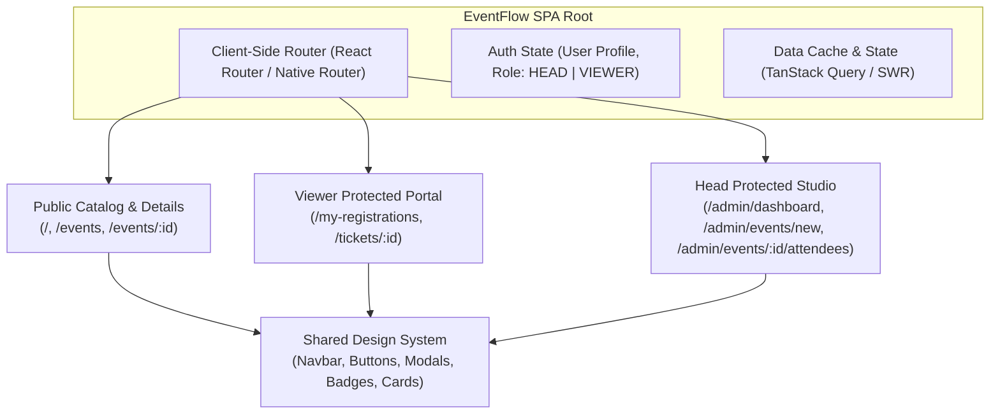
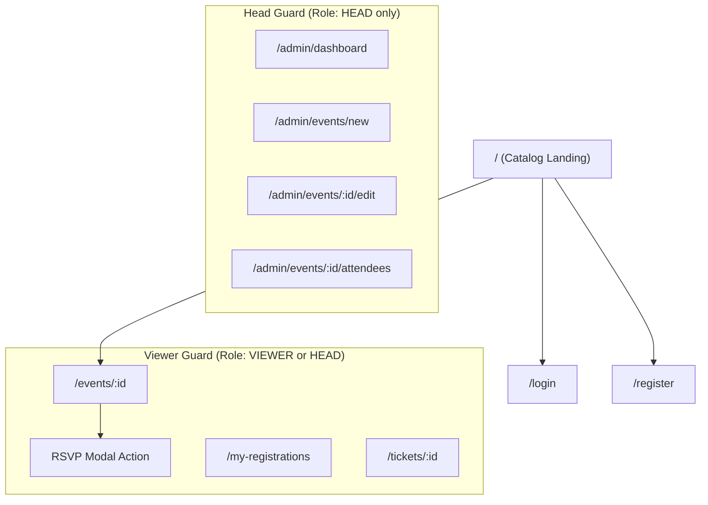
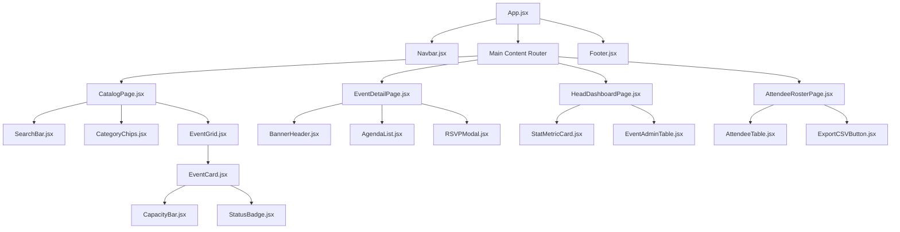

# EventFlow — Frontend Specification & Design System

> Comprehensive frontend architectural blueprint, UI/UX design specifications, wireframes, and component hierarchy for the **EventFlow Event Management System**, aligned with [idea.md](file:///c:/Users/lenovo/lfdt/idea.md) and [architecture.md](file:///c:/Users/lenovo/lfdt/architecture.md).

---

## 1. Frontend Architectural Overview

The EventFlow client is designed as a responsive Single Page Application (SPA) offering two distinct, role-tailored user experiences:
1. **Attendee Portal (Normal Viewer):** Frictionless discovery, rich event details, real-time seat availability, and one-click RSVP.
2. **Organizer Studio (Head User):** Comprehensive event builder, lifecycle management controls, real-time capacity analytics, and attendee roster management.



---

## 2. Design System & Style Guidelines

### 2.1 Color Palette
A modern, dark-accented aesthetic with high-contrast functional status indicators:

| Token Name | Hex Value | Usage |
| :--- | :--- | :--- |
| `--bg-primary` | `#0B0F19` | Deep slate canvas background |
| `--bg-surface` | `#151D2E` | Card & modal background surfaces |
| `--bg-surface-elevated` | `#1E293B` | Hover states, dropdowns, input fills |
| `--border-subtle` | `#334155` | Subtle container borders |
| `--brand-primary` | `#6366F1` | Indigo / Violet primary actions & highlights |
| `--brand-secondary` | `#8B5CF6` | Vibrant purple gradients & accents |
| `--text-main` | `#F8FAFC` | Primary heading and body text |
| `--text-muted` | `#94A3B8` | Subtitles, labels, and helper text |
| `--status-success` | `#10B981` | Open slots, Confirmed tickets (`bg: #064E3B`) |
| `--status-warning` | `#F59E0B` | Seats filling fast, Waitlist alerts |
| `--status-danger` | `#EF4444` | Sold out, Cancelled events, Delete actions |

### 2.2 Typography
* **Font Family:** `Inter`, system-ui, sans-serif (Clean, highly legible at small sizes).
* **Display Font (Headings):** `Outfit` or `Plus Jakarta Sans` for clean, bold titles.
* **Type Scale:**
  * `Display / H1`: `2.25rem` (36px) — Bold (700)
  * `H2`: `1.75rem` (28px) — Semi-Bold (600)
  * `H3`: `1.25rem` (20px) — Semi-Bold (600)
  * `Body Large`: `1.0rem` (16px) — Regular (400) / Medium (500)
  * `Body Small / Caption`: `0.875rem` (14px) — Regular (400)
  * `Badge / Micro`: `0.75rem` (12px) — Medium (500) uppercase

---

## 3. Information Architecture & Routing

### 3.1 Route Table & Access Controls



| Route Path | View / Component | Access Level | Description |
| :--- | :--- | :--- | :--- |
| `/` or `/events` | `CatalogPage` | **Public** | Event catalog with search, category tabs, and filters. |
| `/events/:id` | `EventDetailPage` | **Public** | Complete event breakdown, agenda, venue map/link, RSVP. |
| `/login` | `LoginPage` | **Public** | User login with credentials & role assignment. |
| `/register` | `RegisterPage` | **Public** | User registration (selects Viewer or Head role). |
| `/my-registrations` | `MyRegistrationsPage` | **Viewer / Protected** | User's active & past RSVP tickets with cancel options. |
| `/admin/dashboard` | `HeadDashboardPage` | **Head Only** | Organizer dashboard: metrics, event table, quick links. |
| `/admin/events/new` | `CreateEventPage` | **Head Only** | Event creation form with real-time preview. |
| `/admin/events/:id/edit` | `EditEventPage` | **Head Only** | Edit event metadata, change status, update capacity. |
| `/admin/events/:id/attendees`| `AttendeeRosterPage`| **Head Only** | Live roster, search/filter participants, export CSV. |

---

## 4. Component Hierarchy & Atomic Design



### Component Categories:
1. **Atoms:**
   * `Button`: Primary, Secondary, Ghost, Danger variants.
   * `Badge`: Status tags (`OPEN`, `FILLING FAST`, `FULL`, `DRAFT`, `CANCELLED`).
   * `CapacityMeter`: Visual progress bar showing filled slots (`e.g., 85/100`).
   * `Input` / `Select` / `Textarea`: Dark-themed accessible form controls.
2. **Molecules:**
   * `EventCard`: Visual card with poster, title, date badge, capacity indicator, and CTA.
   * `AttendeeRow`: Individual row showing participant name, email, registration date, and status.
   * `SearchFilterBar`: Combined keyword search and category selector chips.
3. **Organisms:**
   * `Navbar`: Responsive header with brand logo, catalog link, role switch/badge, and profile dropdown.
   * `EventCreationForm`: Form with validation for date/time, venue/link, capacity, and rich description.
   * `AttendeeTable`: Sortable, filterable table displaying registered users with CSV export trigger.

---

## 5. UI / UX Wireframe Blueprints

### 5.1 Public Event Catalog (`/events`)
```text
+-----------------------------------------------------------------------------------+
|  [Logo] EventFlow          Explore Events    My Registrations    (Sarah - HEAD v) |
+-----------------------------------------------------------------------------------+
|                                                                                   |
|   Discover Amazing Tech, Cultural & Workshop Events                               |
|   [ Search by title, keyword, or speaker...           ]  [ All Dates v ]          |
|                                                                                   |
|   [ All ]  [ Workshops ]  [ Conferences ]  [ Hackathons ]  [ Cultural ]           |
|                                                                                   |
|   +-----------------------+ +-----------------------+ +-----------------------+   |
|   | [Banner Image]        | | [Banner Image]        | | [Banner Image]        |   |
|   | Oct 14 * In-Person    | | Oct 18 * Virtual      | | Oct 25 * In-Person    |   |
|   | Full-Stack AI Summit  | | React & Vite Master   | | Cloud Architecture 101|   |
|   | Capacity: [||||||..]  | | Capacity: [||||||||||]| | Capacity: [||.......] |   |
|   | 68 / 100 spots filled | | SOLD OUT (Waitlist)   | | 20 / 150 spots filled |   |
|   | [View Details & RSVP] | | [Join Waitlist]       | | [View Details & RSVP] |   |
|   +-----------------------+ +-----------------------+ +-----------------------+   |
+-----------------------------------------------------------------------------------+
```

### 5.2 Event Detail & RSVP View (`/events/:id`)
```text
+-----------------------------------------------------------------------------------+
|  < Back to Events                                                                 |
|  +-----------------------------------------------------------------------------+  |
|  | [Event Banner Image Header - Modern Gradient Overlay]                       |  |
|  | Tech Workshop * Published                                                    |  |
|  | Advanced Node.js Microservices & Event Architecture                         |  |
|  | Organized by: Sarah Jenkins (Lead Architect)                                |  |
|  +-----------------------------------------------------------------------------+  |
|                                                                                   |
|  LEFT COLUMN (70%)                     | RIGHT COLUMN - STICKY RSVP (30%)         |
|  - Date: Friday, Oct 24, 2026          | +-------------------------------------+  |
|  - Time: 10:00 AM - 4:00 PM IST        | | Reserve Your Seat                   |  |
|  - Venue: Main Auditorium / Hall B     | |                                     |  |
|                                        | | Live Capacity: 42 / 100 remaining   |  |
|  About this Event                      | | [█████████████▒▒▒▒▒▒▒▒] 58% filled  |  |
|  Deep dive into distributed systems,   | |                                     |  |
|  event streams, and resilient APIs...  | | [  Confirm RSVP / Register Now   ]  |  |
|                                        | | * Instant email ticket confirmation |  |
|  Schedule & Agenda                     | +-------------------------------------+  |
|  * 10:00 AM - Opening & Keynote        |                                          |
|  * 11:30 AM - Hands-on Lab Session     | Share Event: [Copy Link] [Add to Cal]    |
|  * 02:00 PM - Panel Discussion         |                                          |
+-----------------------------------------------------------------------------------+
```

### 5.3 Head User — Organizer Studio Dashboard (`/admin/dashboard`)
```text
+-----------------------------------------------------------------------------------+
|  [Logo] EventFlow Studio        [+ Create New Event]   (Admin: Sarah Jenkins)     |
+-----------------------------------------------------------------------------------+
|                                                                                   |
|   OVERVIEW METRICS                                                                |
|   +-------------------+ +-------------------+ +-------------------+               |
|   | Total Events      | | Total Attendees   | | Avg. Capacity     |               |
|   | 8 Active          | | 482 Registered    | | 78% Fill Rate     |               |
|   +-------------------+ +-------------------+ +-------------------+               |
|                                                                                   |
|   MANAGE YOUR EVENTS                                                              |
|   [ Search events...                                ]  [ Filter: All Statuses v ] |
|                                                                                   |
|   | Event Title          | Date         | Capacity    | Status     | Actions    | |
|   | Full-Stack AI Summit | Oct 14, 2026 | 68 / 100    | PUBLISHED  | [Roster]   | |
|   | React 19 Deep Dive   | Oct 18, 2026 | 100 / 100   | FULL       | [Roster]   | |
|   | UI/UX Design Sprint  | Nov 02, 2026 | 12 / 50     | DRAFT      | [Edit]     | |
|                                                                                   |
|   * [Roster] button navigates directly to Attendee Management Table               |
+-----------------------------------------------------------------------------------+
```

### 5.4 Head User — Attendee Management Table (`/admin/events/:id/attendees`)
```text
+-----------------------------------------------------------------------------------+
|  < Back to Dashboard                                                              |
|  Attendees for: "Full-Stack AI Summit" (68 Confirmed / 100 Max)                   |
|  [ Search attendee name or email...       ]   [Status: All v]   [📥 Export to CSV]|
|                                                                                   |
|  | #  | Name            | Email                | RSVP Date   | Status     | Action|
|  | 1  | John Doe        | john@example.com     | Oct 01, 2:10| CONFIRMED  | [x]   |
|  | 2  | Michael Scott   | m.scott@dunder.com   | Oct 02, 9:45| CONFIRMED  | [x]   |
|  | 3  | Jane Miller     | jane.m@tech.io       | Oct 02, 1:15| WAITLIST   | [Appr]|
+-----------------------------------------------------------------------------------+
```

---

## 6. Frontend State Management & Data Fetching

### 6.1 State Architecture & Supabase Integration
* **Global Auth State (`AuthContext` via Supabase Auth / REST):**
  * `user`: `{ id, fullName, email, role: 'HEAD' | 'VIEWER' }`
  * `isAuthenticated`: `boolean`
  * `login(credentials)` / `logout()` via Supabase Auth or API session.
* **Server State (TanStack Query / Supabase SDK):**
  * Cached queries with automatic background revalidation:
    * `useEvents(filters)`: Caches catalog events.
    * `useEventDetails(id)`: Fetches single event metadata + live capacity.
    * `useAttendees(eventId)`: Fetches attendee table for Head Users.
* **Realtime Capacity Subscriptions (`supabase.channel`):**
  * Event detail pages subscribe to Supabase Realtime changes on the `registrations` table to update remaining seat counts on the fly without manual page refresh.
* **Asset Uploads (`supabase.storage`):**
  * Head users upload event banner images directly to the `event-banners` Supabase Storage bucket, getting instant public CDN URLs.
* **Optimistic UI Updates:**
  * When a viewer clicks **"Register"**, the UI immediately decrements available spots and marks button as "Registered" while the network request is inflight, rolling back only if the server returns capacity failure.

---

## 7. Frontend Security & Route Guards

### 7.1 Role Guard Implementation Pattern
```jsx
// src/components/common/RoleRoute.jsx
import { Navigate } from 'react-router-dom';
import { useAuth } from '../../context/AuthContext';

export const RoleRoute = ({ children, allowedRoles }) => {
  const { user, isAuthenticated, isLoading } = useAuth();

  if (isLoading) return <LoadingSpinner />;
  if (!isAuthenticated) return <Navigate to="/login" replace />;
  if (!allowedRoles.includes(user.role)) {
    return <Navigate to="/events" replace />;
  }

  return children;
};
```

---

## 8. Form Validation & UX Details

* **Event Creation Form Validation:**
  * `Title`: Minimum 5 characters, max 100.
  * `Start Date`: Must be greater than current date/time.
  * `End Date`: Must be greater than `Start Date`.
  * `Capacity`: Positive integer (minimum 1).
  * `Location`: If `IN_PERSON`, require venue address; if `VIRTUAL`, validate URL format.
* **Accessibility (a11y):**
  * Semantic HTML5 elements (`<header>`, `<main>`, `<article>`, `<nav>`, `<section>`).
  * Contrast ratio &ge; 4.5:1 for all text against backgrounds.
  * Full keyboard accessibility for modal opening, closing (via `Escape`), and RSVP confirmation.
