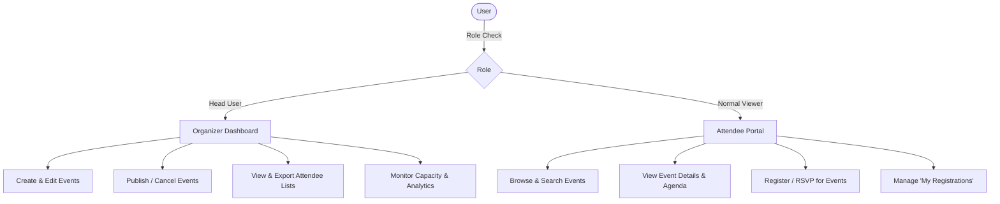
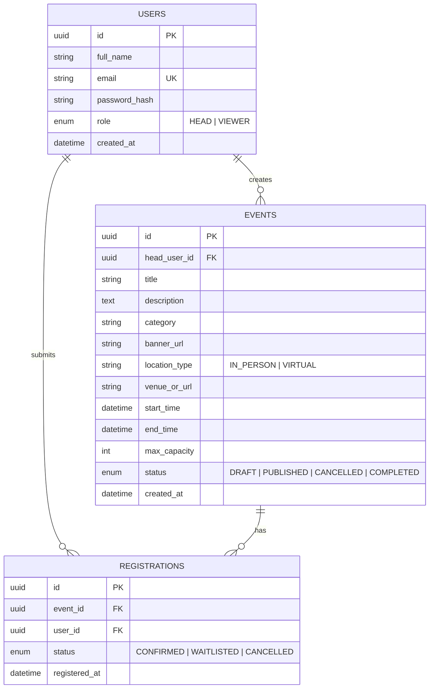
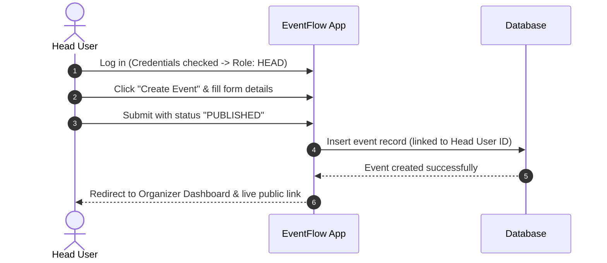
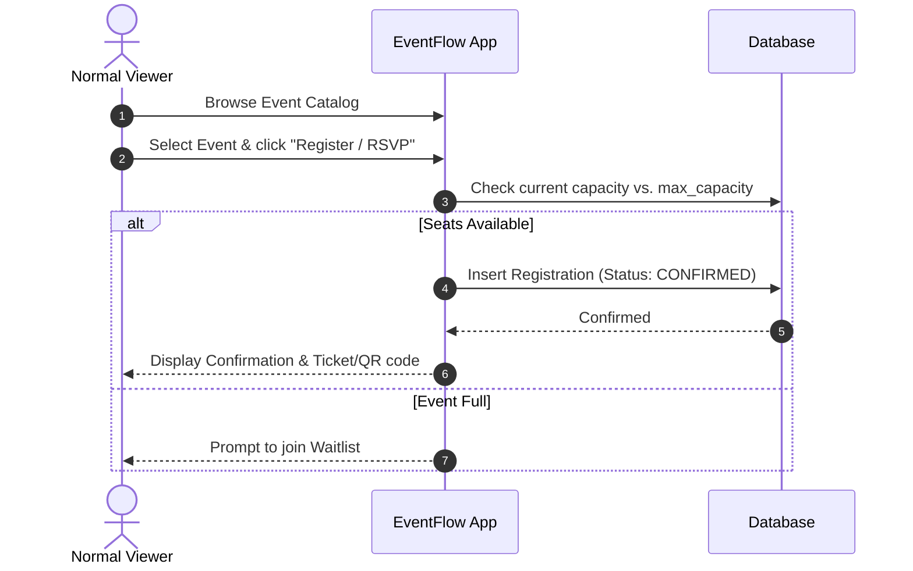

# EventFlow — Event Management System

> A streamlined, role-based event organization and attendee management platform.

---

## 1. Executive Summary

**EventFlow** is an end-to-end Event Management System designed to simplify how events are organized, scheduled, discovered, and attended. The platform provides a unified interface connecting two primary user archetypes:
1. **Head Users (Organizers / Administrators)** who curate, schedule, and oversee events.
2. **Normal Viewers (Attendees / Participants)** who explore, view, and RSVP for upcoming events.

The system automates the event lifecycle—from initial draft creation to attendee check-in and post-event analytics.

---

## 2. Problem Statement & Solution

| The Problem | The EventFlow Solution |
| :--- | :--- |
| Fragmented coordination across spreadsheets, chat groups, and email threads. | Centralized dashboard for creating, managing, and monitoring all events. |
| Inability to track real-time attendee counts and seat availability. | Live capacity monitoring with instant RSVP tracking and automated waitlisting. |
| Lack of clear role separation leading to accidental modifications or data leaks. | Strict Role-Based Access Control (RBAC) separating **Head** actions from **Viewer** actions. |
| Cluttered or confusing user experience for participants seeking event details. | Clean, responsive discovery catalog with search, filtering, and instant one-click registration. |

---

## 3. User Roles & Permissions Matrix

The system enforces strict permission boundaries between the two distinct user classes:

### Role Breakdown

### A. Head User (Organizer / Administrator)
* **Event Management:**
  * Create new events with full metadata (title, category, banners/posters, date/time, venue or virtual meeting link, description, agenda, tags).
  * Edit and update existing event details (schedules, venue changes, speaker notes).
  * Toggle event lifecycle state (`Draft` &rarr; `Published` &rarr; `Live` &rarr; `Completed` &rarr; `Cancelled`).
  * Set registration limits (maximum seat capacity, registration closing deadlines).
* **Attendee Oversight:**
  * View registered participants in real-time with search and filter capabilities.
  * Export attendee rosters to CSV or Excel.
  * Manually approve, waitlist, or cancel attendee registrations if needed.
* **Analytics & Reporting:**
  * Summary metrics: Total Registrations, Capacity Fill Rate, and Attendee Turnout Rate.

### B. Normal Viewer (Attendee / General User)
* **Event Discovery:**
  * Browse the public event feed with cards displaying title, date, time, venue, and remaining slots.
  * Search by keyword and filter by category (e.g., Workshops, Tech Talks, Cultural, Sports) or date range.
* **Event Details:**
  * Access comprehensive event pages featuring detailed descriptions, schedules/agendas, speaker profiles, and venue location.
* **Registration & Tickets:**
  * One-click RSVP/Registration for open events.
  * Automatic waitlist placement if capacity is reached.
  * Receive registration confirmation with unique registration ID / QR code.
* **Personal Dashboard:**
  * View personal registration history under "My Events" (Upcoming vs. Past).
  * Option to cancel RSVP if no longer able to attend, automatically freeing up capacity.
  * Add event to Google Calendar / Apple Calendar via `.ics` download.

---

## 4. Core System Features

### 4.1 Event Creation Module (Head User)
* **Form Fields:**
  * **Basic Info:** Event Title, Short Summary, Category / Type.
  * **Schedule:** Start Date/Time, End Date/Time, Timezone.
  * **Location:** Physical Address / Venue Hall OR Virtual Meeting URL (Zoom/Meet/Teams).
  * **Capacity & Tickets:** Free vs. Paid (optional), Max Attendee Limit, RSVP Cut-off Date.
  * **Media:** Banner Image Upload (or preset stock banner selection).
  * **Description & Agenda:** Rich-text markdown support for detailed breakdowns.

### 4.2 Discovery & Catalog Module (Viewer)
* Responsive grid/card layout displaying active events.
* Visual indicators for event status: `Seats Filling Fast`, `Sold Out / Waitlist`, `Happening Today`.
* Multi-parameter search (by title, speaker, tags, date).

### 4.3 Registration & Capacity Engine
* Race-condition safe seat allocation to prevent over-subscription.
* Real-time capacity counter (`e.g., 42 / 100 spots filled`).
* Automated notification confirmation on successful RSVP.

---

## 5. Proposed Data Model & Schema

---

## 6. Recommended Technology Stack

| Layer | Technology Options | Rationale |
| :--- | :--- | :--- |
| **Frontend** | React / Next.js with Tailwind CSS or Modern CSS | Fast rendering, component modularity, clean UI for attendee and organizer portals. |
| **Backend / API** | Node.js (Express) or Next.js Server Actions | Lightweight RESTful middleware handling validation, business workflows, and reporting. |
| **Database & BaaS** | **Supabase** (PostgreSQL engine + Row Level Security) | Relational integrity, built-in Row Level Security (RLS), real-time subscriptions, and scalable managed Postgres. |
| **Authentication** | **Supabase Auth** / JWT with RBAC | Built-in user identity management, password hashing, and custom role claims (`HEAD` vs `VIEWER`). |
| **File Storage** | **Supabase Storage** | Dedicated media buckets (`event-banners`) for event poster uploads and CDN asset delivery. |
| **Styling** | Modern CSS / Tailwind with dark & light theme | High visual polish, glassmorphic cards, and mobile-first responsiveness. |

---

## 7. User Journey Workflows

### 7.1 Event Creation & Publishing (Head User)

### 7.2 Event Discovery & Registration (Viewer)

---

## 8. Implementation Roadmap (Phased Approach)

* **Phase 1 (MVP — Minimum Viable Product):**
  * User Authentication (Register/Login) with role assignment (`HEAD` vs `VIEWER`).
  * Event creation and publishing by Head Users.
  * Public event list and detailed event view for Viewers.
  * RSVP/Registration button with basic capacity tracking.
* **Phase 2 (Enhancements & Usability):**
  * Search, category filtering, and date filters.
  * Head User Attendee management table (view list + export to CSV).
  * "My Registrations" view for Viewers to manage and cancel bookings.
* **Phase 3 (Advanced Features):**
  * QR Code check-in scanner for Head Users at venue entrance.
  * Automated email reminders 24 hours prior to event start.
  * Post-event feedback and ratings collection.
